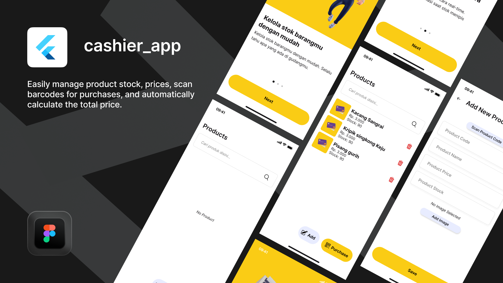

# cashier_app

Open source customizable cashier app built with Flutter.



Features:
- Manage product names, stock, prices, and photos.
- Easy product search.
- Barcode scan for product input.
- Barcode scan for product purchase.
- Automatically calculates total price.
- Automatic stock update on purchase.

## installation
install
```
git clone https://github.com/rizmulya/cashier_app
cd cashier_app
flutter pub get
flutter run
```

customizable:
- assets/logo
- lib/const.dart (primaryColor, currency, etc)
- intro screen at main.dart

build
```
flutter build apk --release
```

## license

This project is under the [MIT license](https://opensource.org/license/mit) 

credits
- [rizmulya](https://github.com/rizmulya) 
- [uwayxt](https://dribbble.com/WahyudiID)
- rifqi